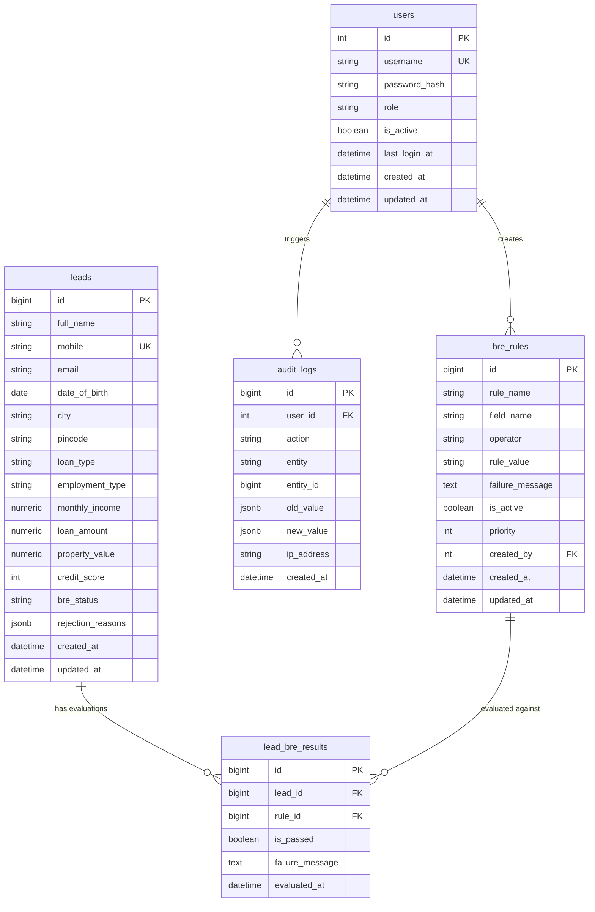

# Database Design Specification

## Overview
The **MoneyBeing Loan Eligibility & Lead Management System** database is designed for PostgreSQL with high performance, strict data integrity, auditability, and dynamic rule-based loan evaluation.

---

## Entity Relationship Summary

---

## Detailed Table Specifications

### 1. `users` Table
Stores authenticated administrative staff credentials, roles, and status.
- **`id`** (`SERIAL`, PK): Unique user identifier.
- **`username`** (`VARCHAR(50)`, Unique, Not Null): Login identifier.
- **`password_hash`** (`VARCHAR(255)`, Not Null): Secure Bcrypt hash.
- **`role`** (`VARCHAR(50)`, Not Null): Role identifier (`Admin`, `Manager`, `Viewer`).
- **`is_active`** (`BOOLEAN`, Default `True`): Active account flag.
- **`last_login_at`** (`TIMESTAMPTZ`, Nullable): Last login timestamp.
- **`created_at` / `updated_at`** (`TIMESTAMPTZ`): Record lifecycle timestamps.

### 2. `leads` Table
Primary customer loan application pipeline table.
- **`id`** (`BIGSERIAL`, PK): Unique lead identifier.
- **`full_name`** (`VARCHAR(100)`, Not Null, Indexed): Applicant's full legal name.
- **`mobile`** (`VARCHAR(15)`, Unique, Not Null, Indexed): Primary 10-digit mobile number preventing duplicate submissions.
- **`email`** (`VARCHAR(100)`, Nullable): Contact email address.
- **`date_of_birth`** (`DATE`, Not Null): Used to calculate age dynamically for BRE evaluation.
- **`city` & `pincode`** (`VARCHAR`): Location details.
- **`loan_type`** (`VARCHAR(30)`, Not Null): `HOME_LOAN` or `LAP` (Loan Against Property).
- **`employment_type`** (`VARCHAR(30)`, Not Null): `SALARIED` or `SELF_EMPLOYED`.
- **`monthly_income`** (`NUMERIC(15, 2)`, Not Null): Exact monthly earnings.
- **`loan_amount`** (`NUMERIC(15, 2)`, Not Null): Requested loan capital.
- **`property_value`** (`NUMERIC(15, 2)`, Not Null): Value of underlying collateral.
- **`credit_score`** (`INTEGER`, Nullable, Indexed): Retrieved score (300-900).
- **`bre_status`** (`VARCHAR(30)`, Nullable, Indexed): `ELIGIBLE`, `NOT_ELIGIBLE`, or `PENDING`.
- **`rejection_reasons`** (`JSONB`, Nullable): Array of human-readable failure messages.

### 3. `bre_rules` Table
Dynamic database-driven business rules loaded and executed at runtime.
- **`rule_name`** (`VARCHAR(100)`, Not Null): e.g. "Minimum Age", "Minimum Credit Score".
- **`field_name`** (`VARCHAR(50)`, Not Null): Field to evaluate (`age`, `monthly_income`, `credit_score`, `loan_ratio`).
- **`operator`** (`VARCHAR(10)`, Not Null): Supported operators (`>=`, `<=`, `>`, `<`, `==`, `!=`).
- **`rule_value`** (`VARCHAR(100)`, Not Null): Target threshold (e.g. `21`, `700`, `80`).
- **`failure_message`** (`TEXT`, Not Null): Explanatory reason when the rule fails.
- **`is_active`** (`BOOLEAN`, Default `True`): Soft toggle for rule activation without deletion.
- **`priority`** (`INTEGER`, Default `1`): Evaluation order.

### 4. `lead_bre_results` Table
Audit trail of every rule evaluation per lead application.
- **`lead_id`** (`BIGINT`, FK to `leads.id`, Cascade Delete).
- **`rule_id`** (`BIGINT`, FK to `bre_rules.id`, Set Null on delete).
- **`is_passed`** (`BOOLEAN`, Not Null): Boolean pass/fail indicator.
- **`failure_message`** (`TEXT`, Nullable): Failure reason captured at evaluation time.

### 5. `audit_logs` Table
Administrative tracking for governance and change control.
- **`user_id`** (`INTEGER`, FK to `users.id`).
- **`action`** (`VARCHAR(100)`): `CREATE`, `UPDATE`, `DELETE`, `STATUS_CHANGE`.
- **`entity`** (`VARCHAR(100)`): `BRE_RULE`, `USER`, `LEAD`.
- **`old_value` / `new_value`** (`JSONB`): Snapshot of changed fields.
